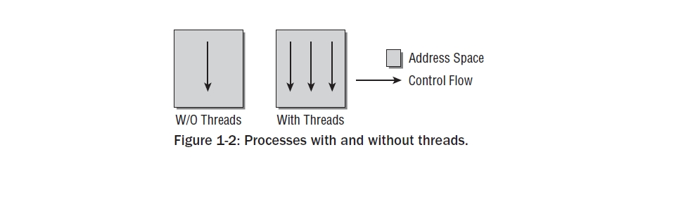
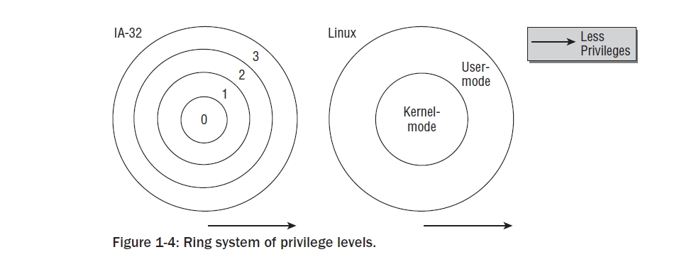
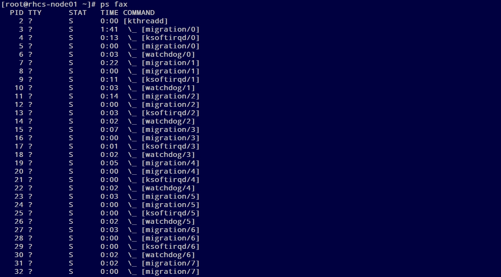
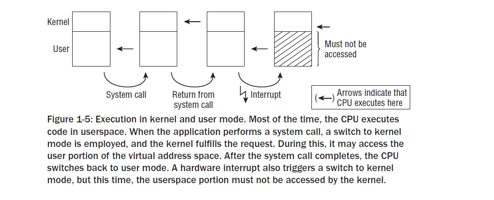
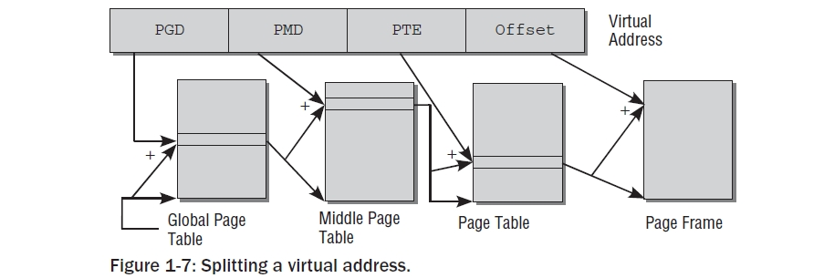

Chapter 1:Introduction and Overview
===================================

 본책을 읽기 위해서는 C 프로그래밍에 대한 기본 지식이 있어야 한다. 커널은 C 프로그래밍의
 진보된 기술을 사용하고 무엇보다도 C GNU 컴파일러를 사용하기때문이다.
 Appendix C에는 훌륭한 프로그래머조차도 친숙하지 않은 파이너 포인터 C를 기술하였다.
 컴퓨터 구조들에 대한 기본 지식은 시스템 하드웨어와(특히 CPU) 직접적으로 필수적으로 상호작용을
 하는 리눅스로서는 유용하게 될것이다.
 그리고 여기에 주제들과 관련된 많은 도입 내용들이 부수적으로 추가되었고, 일부는 참고 섹센에
 두었다.
 좀더 깊이가 있는 CPU를 다룰때( 대부분 IA-32,AMD64를 다뤘고 이 구조는 리눅스에서 가장 최우선으로
 아키텍처로 삼고 있다) 좀더 상세한 관련된 하드웨어를 설명하였다.
 일상적인 삶에서 유비쿼터스하지 않은 메카니즘을 설명할때,그 뒤에 숨어 있는 일반적인 개념들을
 설명하게 될것이다. 따라서 독자들은 그 특별한 특성들이 유저스페이스로 사용되는지에 대해서는 참고로
 읽어야 될것이다.
 이 장에서는 커널의 다양한 영역의 모습들과 다음장에서 다루게 될 각 하위시스템의 좀더 심도있는 관찰에 앞서
 기본적 관계를 다르게 될것이다.

 커널은 빠르게 진화되어왔기때문에 자연스럽게 드는 의문은 어떤 버젼을 이 책에서 다루었느냐이다.
 나는 이책에서 2008년 1월에 릴리즈된 커널 2.6.24를 기준으로 다루었다.
 커널 발전의 다양한 본성은 앞으로 독자들이 읽을때쯤의 새로운 버젼의 커널을 암시할 것이다.
 일정부분은 바뀌게 될것이다. 이것은 회피할 수 없는것이며 이렇게 되지 않았다면 리눅스는 사장되고
 지루한 시스템이 될것이다. 어떤 부분은 변한 반면 기본적으로 컨셉들은 변하지 않을것이다.
 특히나 커널 2.6.24는 이전 버젼과는 확연히 다르게 기본적인 변화들이 있었다.
 개발자들은 이러한 부분들을 너무 많이 성토하지 말길 바란다.

1.1 Task of the Kernel
------------------------
   순수한 기술적 레벨에서 커널은 하드웨어와 소프트웨어의 중간단계이다.
   이것의 목적은 어플리케이션에서의 요청을 하드웨어로 전달하고 시스템의 콤퍼넌트와
   드라이버의 번지수를 지정하는 하위레벨 드라이버로서 동작한다.
   그럼에도 불구하고 또다른 커널을 보는 재미 있는 점이 있다.

  * 커널은 어플리케이션 관점에서 상위레벨에 있는 컴퓨터를 추상화할 수 있는 진보된 기계로
    간주될 수 있다. 예를 들면 커널이 하드디스크를 주소로 할때 그 명령이 어떤 경로를 통해
    디스크로 보내져야 하는지 데이터가 존재하는곳인 디스크에서 메모리로 데이터를
    복사할수 있는 경로를 결정해야 한다. 반면 어플리케이션은 그 데이터가 전달되야 하는
    명령을 발행할 필요만 있다.
    어떻게 이것이 실행되는지는 어플리케이션과는 상관이 없다.상세한것은 커널에 의해 추상화
    되어진다.어플리케이션 프로그램은 하드웨어 자체과 접촉하지 않는다.그들이 알고 있는
    하이러키에서 가장 낮은 레벨을 표현하는 커널만이 접촉을 한다.
    따라서 진보된 기계라고 말할 수 있다.

  * 리소스 매니저로서 커널을 본다는것은 여러 프로그램들이 시스템내에서 동시에 실행된다는것을
    정당화하는 것이다. 이러한 경우에 커널은 동시간대에 시스템을 통합에 신뢰성을 주면서
    다양한 시스템 프로세서간 CPU 타임,디스크 공간,네트웍 연결등에 대한 가능한
    리소스를 공유하는 인스턴스이다.

  * 커널의 또다른 관점은 일련의 시스템에 관련된 명령어들을 제공하는 라이브러리 관점에서
    본다는 것이다. 일반적으로 알듯이,시스템콜은 컴퓨터에 요청을 보낼때 사용되어 진다.
    스탠다드 C 라이브러리 도움말에 의하면, 이러한 것들은 어플리케이션들은 동일한 방법으로
    생성된 일반적인 함수내지 다른 함수로 나타나게 된다.

1.2 Implementation Strategies
-------------------------------
  여기에는  운영시스템의 근간이 되는 두가지 패러다임이 있다.

    - Microkernles
      이것들은 유일한 기본 함수들로서 커널의 중앙부에 구현된다. 모든 다른 함수들은 명확히
      정의된 통신 인터페이스를 통해 중앙부의 커널과 통신하는 자발적인 프로세스들을 대표하게
      된다. 예를 들면 다양한 파일시스템,메모리관리 등이다.( 물론,마이크로 커널안에서 그것
      자체로 시스템과 통신을 컨트롤하는 메모리 관리의 가장 근간이다 어쨋든 시스템콜 레벨을
      다루는것은 외부 서버들에서 구현되어진다.)
      이론적으로 이것은 개별적 부분들이 서로 각각 명확하게 분리되어 있기때문에 매우 우아한
      접근이 된다. 이것은 프로그래머들에게 "클린" 프로그램 기술을 사용하도록 종용하게 된다.
      이러한 접근의 다른 잇점은 다양한 확장성과 러닝타임에 중요한 콤퍼넌트를 스왑할 수 있는
      능력이다.
      그러나 부수적인 CPU 타임을 소유하는것은 컴포턴트들간의 복잡한 통신을 지원할 필요가 있게
      된다.
      마이크로 커널이 현재까지 다양하고 활동적인 연구의 주제로 존재해왔을지라도 그것 자체로
      실제로 만들어지지는 않았다.

    - Monolithic Kernels
      여기에는 보완적이고 전통적인 컨셉이 있다. 여기 커널의 모든 코드- 메모리 관리,파일시스템
      ,디바이스 드라이버같은 서브시스템을 포함하여- 는 하나의 화일로 구성되어진다.
      각 함수들은 커널의 다른 파트에 접근이 가능하다. 이것은 많은 프로그래밍이 많은 주의를
      기울이지 않으면 노력이 필요한 폐쇄된  코드로 결과를 낳을 수 있다.

   현시점에서 Monolithic 커널이 Microkernel 보다 성능상 더 크기때문에 리눅스는 아직도 이러한
   패러다임에따라 구현되어 진다.
   어쨋든, 하나의 중요한 점이 소개되어진다.
   시스템이 로드되고 실행되는 동안 추가되고 삭제되어질 수 있는 커널 코드를 가지는 모듈은
   커널의 모든 범위의 함수들에 다이나믹하게 추가를 지원하게 된다. 따라서 Monolithic 커널의
   단점을 보완하게 된다.
   이것은 커널과 모듈의 핫플러깅과 다이나믹 로딩을 구현하는것을 승인하는 유저랜드와 통신을
   통해 많은 힘겹게 도움을 준다.

1.3 Elements of the Kernel
-----------------------------

 이 장에서는 커널의 다양한 구성요서를 간략한 설명을 제공한다. 그리고 다음장에서 좀더 자세히 설명할
 영역의 아웃트라인을 설명한다.
 획일적인 접근에도 불구하고 리눅스는 놀랍게도 아주 잘 구조화되어 있다.
 그렇지만,그 각각의 엘리먼트들은 상호작용을 한다는것은 필연적이다. 그들은 데이터 구조체를 서로
 공유하고 엄격히 분리된 시스템에서 필요로 될지도 모르는 그 이상으 함수들을 통해 서로가 상호작용을
 하고 있다.
 다음장에서는 내가 앞으로의 참고는 최소화 하고자 하는 노력임에도 불구하고
 커널의 다른 요소들에게  따라서 다른 장에서도 잦은 참고를 하게 되는 내용을 다룬다.
 여기서 각 개별 구성요소를 소개하고 전체적으로 그 역할과 그 위치를 알려주고자 한다.

 다음 그림 Fig1-1은 완전한 리눅스 시스템을 구성하는 레이어들의 대략적인 그림, 그리고 그 하위
 중요 시스템을 표시하였다.
 그림에서는 표시하지 않았지만 각각의 하위 시스템은 다양한 부수적인 방법으로 상호 작용을 한다는
 것을 명심하길 바란다.

  .. image:: ./images/Fig1-1.png

1.3.1 Processes, Task Switching, and Scheduling
~~~~~~~~~~~~~~~~~~~~~~~~~~~~~~~~~~~~~~~~~~~~~~~
   유닉스내에엇 돌아가는 어플리케이션들,서버들,다른 프로그램들은 전통적으로 프로세스를 참고한다.
   각 프로세스는 CPU의 가상 메모리 공간내에 주소값을 할당 받는다.
   각 프로세스의 주소값은 그 프로세스가 서로를 인식 못할만큼 전적으로 독립적이다.
   서로의 프로세스가 관여하는한 시스템의 유일한 프로세스 되는것 같은 인상을 가진다.
   만약 프로세스들이 서로 데이터 교환을 하고자 하면, 예를 들면 특별한 메카니즘이
   사용되어져야 한다.

   리눅스는 멀티 태스킹 시스템이기때문에 여러 프로세스들이 동시 실행되어지는것을 지원한다.
   시스템에 있는 CPU 만큼 많은 프로세스들이 동시간대에 실행될 수 있다.
   동시 프로세싱의 인상을 줄 짧은 시간에 프로세스들간 스위칭을 커널은 수행한다.

     - 1
       커널은 CPU의 도움을 얻어 태스크 스위칭의 기술적 상세함의 의무가 있다.
       각 개별 프로세스는 CPU가 항상 가용하다는 암시가 주워져야 한다.
       이것은 CPU 리소스가 해제되거나 프로세스가 아이들 상태로 가기전에 프로세스의
       모든 상태 의존적인 요소들을 저장함으로서 달성된다.
       프로세스가 재가동 될때 정확히 저장된 상태가 복원된다.
       프로세스들간의 스위칭은 태스크 스위칭으로 알려져 있다.

     - 2
       커널은 어떻게 CPU 타임이 존재하는 프로세스들간에 공유되는지 결정해야 한다.
       중요한 프로세스는 CPU 타임의 많은 부분을 ,덜 중요한 프소세스는 좀더 적게 주워진다.
       어떤 프로세스가 얼마나 오랫동안 실행되어져야 하는것을 결정하는것을 스케줄링이라 한다.

1.3.2 Unix Processes
~~~~~~~~~~~~~~~~~~~~~

  리눅스는 각 프로세스가 부모 프로세스에 의존적인 계층 스키마를 가지고 있다.
  커널은 시스템 초기화 동작에 대한 책임을 지고 있는 처음 프로세서로 init 프로그램을 개시한다.
  그리고 로그인 프롬프트를 표시하거나 그래픽 로그인 인터페이스를 표시한다.
  Init은 따라서 모든 프로세스가 기원이 되는 근원이다.
  pstree 프로그램에 의해 그래픽으로 보여진것처럼, 트리의 브랜치가 더 나아가거나 내려오는
  트리구조의 맨 상단에 있다.

  .. code-block:: console

    $ pstree

아래 트리 구조로 보여진다.

 .. image:: ./images/Fig1-1_00000.jpg

  어떻게 이런 트리가 확장해가느냐는 새로운 프로세스가 어떻게 생성되어가느냐에 아주 밀접하게 연관이 있다.
  이러한 목적으로 유닉스는 fork 와 exec라는 메카니즘을 사용한다.

  - 1. fork
       부모 프로세스의 PID값만 유일하게 다른 현재 프로세스의 정확한 복사본을 만든다. 시스템 콜이 실행된후
       시스템에는 동일한 액션을 취하는 두개의 프로세스가 존재한다.초기 프로세스의 초기 메모리 내용이 복사가
       된다- 최소한 프로그램의 관점에서.  리눅스는 잘 알려진 기술로서 다른 부모 또는 자식 프로세스가 페이지에
       쓰고자할때까지의 복사 동작과 다른 좀더 효과적인 동작인 copy on write 가 있다 - read-only 접근만이
       둘에 대한 동일 페이지를 만족시킬 수 있을 것이다.
       fork를 사용한 가장 가능한 시나리오는, 예를 들자면 ,유저가 두번째 창의 부라우저를 오픈할때이다.
       상응하는 옵션이 선택되면 브라우저는 코드를 복사하는 fork를 실행하고 자식 프로세스에서 새로운 윈도우를
       만들기위해 적당한 동작을 시작한다.
 - 2. exec
       존재하는 콘테츠속으로 새로운 프로그램을 로드하고 실행하는것이다. 이전 프로그램에서 예약된 메모리 페이지는
       사라지고 그들의 콘테츠들은 새로운 데이터로 대체된다. 새로운 프로그램은 실행을 시작한다.

Threads
~~~~~~~~~
   프로세스들은 커널에 의해서 제공되는 유일한 프로그램 실행포맷은 아니다. 무거운 프로세스들과 더불어-
   전통적인 유닉스 프로세스들의 또다른 이름- 트레드라는 것이 있다. 이것은 가벼운 프로세스들로 대표된다.
   그것들은 한동안 회자되어왔고 기본적으로 하나의 프로세스는 모두 동일한 데이타와 리소스를 가지는 여러개의
   트레드로 구성되었을지도 모르지만 프로그램 코드를 통해 다른 루트를 가지고 있을지도 모르겠다.
   트레드라는 컨셉은 많은 현재의 프로그램 언어에 도입되었고-예를 들면 자바.간략히 정리하면 하나의 프로세스는
   실행프로그램으로 보여질 수 있다. 반면 하나의 트레드는 프로그램 함수 또는 메인 프로그램과 병행해서 실행되는
   루틴이다.
   보통 브라우저는 병행 인스턴스를 생성하기 위해  여러개의 fork 와 exec 호출 실행을 해야만 한다; 이러한 것들은
   이미지들을 로딩하는 것이나 어떤 종류의 통신 메카니즘을 통해 메인 프로그램에 필요한 데이터를 만드는데 사용되어
   진다.
   트레드들은 이러한 상황을 다루기 쉽게 만든다. 브라우저는 이미지 로당할 루트를 정의하고 루틴은 여러가닥을(각각 다른
   대입변수를 가진)가진 트레드로 시작된다.
   트레드와 메인프로그램은 메인프로램에서 존재하면서 자동으로 받게되는 동일한 주소값과 데이터를 공유하기때문에
   어떤 통신을 위한 노력이 필요없다. 다만 예외적으로 트레드가 동일한 주소값을 접근하면서 상호 겹치는것을 방지하기
   위한 것은 있다.
   Figure 1-2 트레트가 있고 없는 프로그램의 차이를 나타낸다.

   리눅스는 트레드를 생성하기 위한 clone 메쏘드를 제공한다. 이것은 fork와 유사한 방법으로 동작되지만 어떤 리소스가
   부모 프로세스와 공유되어질지를 정확하게 체크되어질 수 있고 트레드와는 독립적으로 생성된다.
   리소스의 정련된 배분은 전통적인 트레드 개념을 확장하고 다소 트레드와 프로세드간의 다소 연속적인 변환을 허락해야
   된다.

Namespaces
~~~~~~~~~~~

   커널 2.6의 개발하는 동안,네임스페이스의 지원은 수없는 하위 시스템으로 통합되어왔다.
   이것은 다른 프로세스들은 시스템의 다른 뷰를 가진다는것이다. 전통적으로 리눅스는(일반적으로 유닉스도 )
   수없는 전역변수들을 상요한다. 예를 들면 프로세스 구별자: 시스템에서 모든 프로세스들은 독특한 구별자를 가지고 있고
   이러한 ID는 프로세스를 참조하도록 유저에게 제공되어질 수 있다- 예를 들면 신호를 보냄으로써.
   네임스페이스를 가지면 이전의 전역 리소스들은 다르게 그룹되어진다: 모든 네임스페이스는 특별한 PID 셋을 가지거나
   파일시스템의 다른 뷰를 제공할 수 있다, 반면 하나의 네임스페이스에 마우트는  다른 네임스페이스에 전파되지 않는다.

   네임스페이스는 유용하다; 예를 들면, 호스팀 제공자들에게 유용한데: 하나의 고객에게 하나의 물리적 하드웨어를 셋업하는
   대신 각 시스템에서 콘테이너 안에서 완전한 리눅스 인스톨을 할 수 있고 다른 콘테이너와 상호작용 하지 않은 다중 뷰를
   생성할 수 있는 네임스페이스로 구현된 containers 를 사용할 수 있다.
   그것을은 분리되어 있고 서로에게서 격리되어져 있다.
   모든 인스턴스는 리눅스를 싱행하는 단일 머신처럼 보인다. 그러나 사실 많은 인스턴스들은 하나의 물리적 머신내에서
   동시에 동작하게 된다.
   이러한것은 리소스를 좀 더 효율적으로 상요하게 한다.
   KVM과 같은 완전한 가상화에 대비해,해당 머신을 실행하기 위해 단일 커널만 필요하고 모든 콘테이너를 관리하는 역할만 한다.

   커널의 모든 파트가 네임스페이스를 인식하지는 않는다. 다양한 하위시스템을 분석할때 어떤 부가적 지원이 가능한지를 논할
   것이다.

1.3.3 Address Spaces and Privilege Levels
~~~~~~~~~~~~~~~~~~~~~~~~~~~~~~~~~~~~~~~~~~~

   가상 주소공간을 논하기 앞서,수정해야할 중요한 관습들이 있다.
   이 책 전반에 걸처 나는 사이즈의 단위로 KiB,MiB 그리고 GiB 축약을 사용한다.
   관습적인 단위인 KB,MB,GB는 그것들이  바이너리 시스템이 컴퓨팅에서 기본적인 유비쿼터스일지라도 십진법으로(10^3,10^6,
   10^9)표현하기때문에 정보 기술분야에 있어서 적절하지 않다.
   따라서 KiB는 2^10, MiB는 2^20, GiB는 2^30 을 표현한다.

   메로리 영역은 포인터라는 방법으로 주소값이 주어지기때문에, CPU의 워드 길이는 관리되어질 수 있는주소 공간의
   최대 사이즈를 결정한다.
   IA-32,PPC and m68k와 같은 32bit 시스템에서 메모리 영역은 2^32= 4 GiB 이다. 반면 최근의 Alpha,Sparc64,IA-64
   ,AMD64 등은  2^64 바이트가 관리되어 질 수 있다.
   주소공간의 최대 사이즈는 실제 물리적 메모리에 가능한 용량과는 상관이 없다.
   따라서 이것은 가상 주소 공간이라고 알려져 있다. 이런한 용어의 또다른 이유는 시스템에 있는 모든 프로세스는
   이러한 주소공간에서 유일하게 살아있고 다른 프로세스에서는 그들의 관점에서 보면 존재하지 않는다는 인상을 준다는
   것이다.
   어플리케이션은 다른 어플리케이션을 상관할 필요가 없고 그 컴퓨터에서 유일한 프로세스로 돌아가는것처럼 동작할 수
   있다.
   리눅스는 가상 주소 공간을 커널 공간 과 유저 공간으로 나눌 수 있다.
   하기 Fig 1-3에 표시되어졌다.

.. image:: ./images/Fig1-3.jpg

   시스템에 있는 모든 유저 프로세스들은 0에서 TASK_SIZE 길이만큼 확장할 수 있는 가상 주소를 갖는다.
   위에 있는 영역( TASK_SIZE 에서 2^32 or 2^64)은 커널의 주소값으로 정해져 있다-유저 프로세스들에 의해서 접근되어질수
   없는. TASK_SIZE는 주어진 비율에 따라 주소값이 분할되는 아키텍처관점의 변수이다- 예를 들면 IA-32 시스템은
   주소 공간은 각 프로세를 위한 가상 주소 공간이 3 GiB가 되도록 3 GiB에서 나누어져 있다.
   실제적 모습들은 아키텍처에 따라 다를지라도 일반적 컨셉들은 다른지 않다.
   따라서 나중에 논하게될 기본값을 사용한다.

   이 구분은 얼마나 RAM아 가용한지에 의존하지 않는다. 주소 공간 가상화의 결과에 따라 각 유저 프로세서들은
   3 GiB으 메모리를 가지고 있는것처럼 생각한다. 개별적 시스템 프로세스들의 유저공간은 완전히 서로가 분리되어 있다.
   가상 주소 공간의 위 끝부분에 있는 커널공간은  그 프로세스가 현재 실행되는지와는 상관없이 항상 동일하다.

   64-bit 머신에 있어서는 그들의 거대한 최대 가상화 주소 공간을 관리하기 위해 64 bits 보다는 적게 사용할 수 있기때문에
   그림이 좀더 복잡할 수 있다. 64 bits 대신에, 그것들은 예를 들면 42 또는 47 bits를 사용한다.
   이렇기때문에 주소공간의 효과적인 주소할 수 있는 부분은 최대 사이즈보다 작다.
   어쨋든, 머신에서 존재할 RAM의 양보다는 크고  따라서 그정도는 충분하다.
   하나의 특혜로서 CPU는 필요로 하는 완전한 가상화 공간보다는 효과적인 주소공간을 관리하기위해 좀더 적은 bit들이
   필요하기때문에 노력을 줄일 수 있다.
   가상화 주소 공간은 그러한 경우에 Fig 1-3에서 묘사된 심플한 상황이 모두 유효하지 않도록 최대값에서 주소화할 수
   없는 구멍들을 가지게 될 것이다.
   4장에서 이 토픽에 대해서 좀더 자세히 다룰 것이다.

Privilege Levesls
~~~~~~~~~~~~~~~~~~

    커널은 각자로부터 개별적 시스템 프로세스들을 보호할 수 있도록 가상 주소 공간을 2개로 나눈다.
    최근의 모든 CPU들은 어떤 프로세스들이 상주할 수 있는지에 대한 엄격한 특권 레벨을 제공한다.
    여기에는 어떤 어셈블리 언어 집합의 실행 또는 가상화 주소 공간의 특별한 부문에 접근등을 포함해서
    각 레벨에서 다양한 제한을 가지고 있다.
    IA-32 아키텍처는 링으로서 보여질 수 있는 4개의 특권 레벨을 사용한다.
    Fig 1-4에서 처럼 내부 링은 좀더 많은 함수들을 접근할 수 있고 외부쪽의 링은 좀더 적은 접근을 가지게 된다.

    반면 인텔 계열은 4개의 레벨로 구분한 반면 , 리눅스는 유일한 2개의 다른 모드를 사용한다- 커널 모드와 유저 모드이다.
    2가지 사이에 중요한 차이점은 유저모드에서 제한되어있는 TASK_SIZE위에 있는 - 말하자면 커널 공간- 메모리 공간의
    접근에 있다 .
    유저 프로세스들은 복제하거나 커널 공간에 있는 데이터를 읽을 수 없다. 뿐만아니라 그곳에 저장되 있는 코드도 실행할
    수 없다. 이것은 커널의 신성한 부분이다. 이러한 메카니즘은 서로의 데이터에 의도하지 않은 영향을 끼치지 못하도록
    하고 있다.

   유저모드에서 커널모드에의 변환은 system calls 라는 특별한 변이방법으로 만들어 진다; 이것은 시스템에따라 다르게
   실행된다. 일반적 프로세스가 전시스템에 영향을 끼치는 종류의 액션을 실행하고자 한다면( 예를 들면 I/O 디바이스 복제)
   시스템콜의 도움으로 커널에 요청함으로써만 이것을 할 수 있다. 커널은 해당 프로세스가 원하는 액션을 실행하는 허락여부
   를 체크하고 해당 액션을 실행한다. 리턴은 유저모드로 만들어진다.

   유저 프로그램의 실행을 위해서 코드를 실행하는것 이외에 커널은 비동기적인 하드웨어 인터럽트에 의해 활성화될 수
   있다. 프로세스 컨텍스트에서 실행되는것과의 차이점은 가상화 주소 공간의 유저 공간이 접근되어지지 말아야 된다는
   것이다. 인터럽트는 불특정 시간에 발생되기때문에,불특정 유저영역의 프로세스들은 인터럽트가 발생될때 활성화된다.
   대부분 인터럽트는 해당 인터럽트의 원인과 함께 해제될것이기때문에 현재의 유저공간의 콘텐츠들과 연관성을 가지고 있지
   않다. 인터럽트 컨텍스트내에서 실행될때, 커널은 평시보다 더 주의가 요구된다;예를들면,커널은 슬립으로 들어가면 안된다.
   chapter 2에서 자세히 다를 인터럽트 핸들러를 쓸때 더욱 조심해야 된다. 상이한 실행 컨텍스트는 Fig 1-5에 놓았다.

   일반적인 프로세스들과는 별개로 ,시스템에서 돌아가는 커널 트레드라는것이 존재할 수 있다. 커널 트레드는 어떤
   특정한 유저공간의 프로세스들과는 관련이 없다 , 그래서 주소 공간의 유저 부분과는 관계가 없다.
   많은 다른 관점에서, 커널 트레드는 일반적인 유저영역의 어플리케이션과 비슷하게 행동할지라도 : 인터럽트 콘텍스트에서
   커널을 실행하는것과는 대조적으로, 그것들은 슬립에 들어갈 수도 있고 시스템에 있는 모든 정상적인 프로세스들처럼
   스케줄러에 의해 추적이 될 수 있다. 커널은 이것들은  RAM과 블락디바이스의 데이터 동기화에서부터  그리고 CPU들간
   프로세스들을 분배하는  스케줄러는 돕는 역할까지 다양한 목적으로 사용한다.

   커널 트레드는 ps의 결과물로 쉽게 구별되어질 수 있다. 왜냐하면 그들의 이름은 브라켓 안에 존재하기때문이다.

.. code-block:: console

    $ ps

   다중프로세서 시스템에서,많은 트레드는 CPU 기준으로 시작되고 유일한 하나의 프로세서에서만 실행되도록 제한되어진다.
   이것은 커널 트레드 이름에 부가적으로 슬래시와 CPU 숫자로 표시된다.

Virtual and Physical Address Spaces
~~~~~~~~~~~~~~~~~~~~~~~~~~~~~~~~~~~~

   대부분의 경우에, 단일 가상화 주소 공간은 시스템에서 물리적 가용 RAM보다 더 크다.
   그리고 이러한 상황은 각 프로세스가 각자의 가상 주소 공간을 가질때 향상되지 않는다. 커널과 CPU는 따서서
   어떻게 실제 가용 메모리가 가상 주소 영역에 매핑되어질 수 있는지 고려해야 된다.

   선호하는 방법으로 가상 주소를 물리적 주소에 할당하는 페이지 테이블을 사용한다.  가상화 주소들은
   하나의 프로세스에 결합된 유저 와 커널 공간에 관련된 반면, 물리적 주소들은 실제 가용 RAM을 주소값으로
   하는데 사용된다.
   이러한 원리는 Fig 1-6에 표시한다.
   그림에 보여지는 두개의 프로세스의 가상화 주소 공간은 커널에 의해 동일 사이즈로 구분되어진다.
   이러한 부분을 pages 라고 한다. 물리적 메모리 또한 동일 사이즈의 페이지들로 구분되어진다.

.. image:: ./images/Fig1-6.jpg

   Fig 1-6은 가상화 주소 공간에 있는 페이지들이 어떻게 물리적 페이지에 걸쳐 있는지를 보여준다. 예를 들면 프로세스
   A의 가상 페이지 1은 물리 페이지 4에 매핑되어진다. 반면 프로세스 B의 가상화 페이지 1은 5번째 물리적 페이지에
   매핑된다. 이것은 가상화 주소는 프로세스에서 프로세스로 그 의미가 변경된다는 것을 보여준다.
   가상 주소공간과 물리적 메모리 사이의 매핑은 로딩되어질 프로세스들간의 엄격한 분리를 가능하게 해준다.
   예제에서는 두개의 프로세스에 의해 공유되어지는 명확한 페이지 프레임을 포함한다.
   A의 페이지 5와 B의 페이지 1은 물리적 프레임 5를 가리키고 있다. 이것은 양쪽의 가상 주소 공간의 접점이 동일한
   페이지를 가리키기때문에 가능하다. 커널은 가상 주소 공간을 물리적 주소 공간으로 매핑하는 역할을 하기때문에
   어떤 영역의 메모리가 프로세스들간 공유되어져야 되고 어떤것은 공유되지 말아야 될지 결정할 수 있다.

   그림은 또한 가상 주소 공간의 모든 것이 프레임 페이지에 연결되어 있지만은 않다는 것을 보여준다.  이것은 양쪽의
   페이지들이 사용되지 않기때문이거나 데이터가 아직 필요하지 않아 메모리에 적재되자 않았기때문일지도 모르겠다.
   이것은 또한 페이지가 하드디스크에 스왑되어졌을지도 모르고 필요할때 다시 원복되어 스왑되어질 것이다.

   마지막으로,주의할 것은 유저를 위해 실행되는  어플리케이션의 주소값을 나타내는 두가지 유사한 문구가 있다.
   하나는 userland 이고, 이것은 커널에 포함되지 않은 것들의 BSD 커뮤니티에 의해서 선호되는 명명법이다.
   또다른 선택은 어플리케이션이 userspace 에서 돌아간다고 말하는 것이다. userland라는 말은 항상 어플리케이션과
   같은것을 의미할 것이며 반면 userspace는 부수적으로 어플리케이션을 나타내는것뿐만 아니라 그것들이 실행할 수
   있는 가상 주소 공간을 나타낸다. 이것은 kernel space와는 대조적이다.

1.3.4 Page Tables
~~~~~~~~~~~~~~~~~~~~

   page tables 라고 알려진 데이터 구조들은 가상 주소 공간을 물리적 주소 공간에 맵핑하는 데 사용된다.
   2개 사이의 관계를 구현하는 가장 쉬운 방법은 가상 주소 공간에 있는 각 페이지를 위한 시작점을 포함하는 어레이를
   사용하는 것이다. 이러한 시작점은 관련된 페이지 프레임을 표시할 것이다. 그러나 문제가 있다.
   IA-32 구조는 예를 들면 4 KiB 페이지를 사용한다- 가상화 주소 공간이 4 GiB가 주어지면,이것은 백만개의 시작점을
   가지는 어레이를 만들게 될것이다. 64bit 구조에서는 이러한 상황은 더 악화된다.
   왜냐하면 모든 프로세들은 자기만은 페이지 테이블이 필요하기때문에, 이러한 접근은 시스템의 모든 RAM이 페이지
   테이블을 유지하는데 필요할 것이라서 실용적이지 못하다.
   가상 주소 공간의 많은 부분이 사용되지 않고 따라서 페이지 프레임과 연관성이 없으므로, 동일한 목적을 충족시킬
   다소 메모리 집중적인 모델이 사용되어 질 수 있다: 멀티레벨 페이징

   페이지 테이블 사이즈를 줄이고 불필요한 영역을 무시하도록 허가하기위하여, 아키텍처는 각각의 가상 주소를 여러개로
   나눈다. 그림 Figure 1-7 에 보는것처럼(주소가 나뉘는 비트 포지션은 아키텍처에 따라 다르지만, 여기서는 관련이 없다)
   예제에서, 나는 가상 주소를 4개의 컴포넌트로 나누었고, 이것은 3레벨 페이지 테이블이다. 이것은 대부분의 아키텍처가
   제공하는 것이다. 어쨋든,몇몇은 4레벨 페이지 테이블을 채택하고 리눅스 또한 간접적으로 4 레벨을 수용했다.
   그림을 간략화하기 위해, 나는 여기서 3 레벨 변수를 고집한다.

   가상화 주소의 첫번째 부분은 page global directory (PGD)를 참조한다.  이것은 각 프로세스들을 위해서 정확히 한번
   존재하는 어레이에서 인덱스로서 사용되어진다. 그것의 시작점은 page middle director( PMD) 라고 불리는 다음 어레이의
   시작을 알리는 점들이 된다.

   일단 상응하는 어레이가 PGD의 참조로서 발견되면, 그 컨텐츠와 PMD는 어레이의 인덱스로서 사용된다.
   페이지 미들 디렉토리는 페이지 테이블과 페이지 디렉토리로서 알려진 다음 어레이들의 지시점들로 구성된다.

   가상 주소의 PTE(page table entry) 부분은 페이지 테이블의 인덱스로 사용되어 진다. 가상 페이지와 페이지 프레임의
   매핑은 페이지 테이블의 시작점을 페이지 프레임에 위치함으로써 성립된다.

   가상 주소의 마지막 부분은 offset으로 정해진다. 이것은 해당 페이지 안에서 바이트 위치를 나타내는데 사용된다.
   ;결국, 각각의 주소는 주소공간에서 유일하게 정의된 바이트를 가리킨다.

   페이지 테이블의 특별한 부분은 어떠한 페이지 미들 테이블 또는 페이지 테이블도 필요로 하지 않은 가상 주소 공간의
   영역을 위해서 생성될 필요가 없다는 것이다. 이것은 RAM이 단일 어레이 방법을 가진는것에 비해 커다란 차이점이다.

   물론 이러한 방법은 하향지향을 가진다. 각각의 시간 메모리가 접근된다면, 가상 주소값으로부터 물리적 주소값을 얻기
   위해 전체적 체인을 통해 실행되어야 할 필요가 있다.

   - 1.  MMU(memory management unit)이라고 알려진 CPU의 특별한 부분은 참조 함수들을 수행하는데 최적화 되어 있다.

   - 2.  주소 변환에서 종종 나타나는 주소값들은 TLB(Translation Loookaside Buffer)라고 알려진 빠른 CPU 캐시에
         잡혀있다. 주소 변환은 캐시에 있는 주소 데이터들이  페이지 테이블과 결국은 RAM에 접근할 필요없이 즉흥적으로
         가능해지기때문에 가속화된다.

         캐시가 많은 아키텍처에서 투명하게 동작하기때문에 페이지 테이블의 콘텐츠가 변환할때마다 그들의 컨텐츠는
         무효화되어져야 한다는것을 암시하는 커널관점에서  관심을 기울여야 한다. 상응하는 호출은 페이지 테이블을
         복사하는 커널의 모든 부분에서 나타나야 한다. 만약 커널이 그러한 동작을 요구하지 않은 아키텍처로 컴파일
         된다면 그것은 자동적으로 호출은 아무것도 하지 않는 동작으로 표현된다는 것이 확실하다.

Interaction with the CPU
~~~~~~~~~~~~~~~~~~~~~~~~~~

   IA-32 아키텍처는 가상 주소값을 물리적 주소값으로 매핑되는 2 레벨  방법을 사용한다. 64bit 아키텍처(Alpha,Sparc64,
   ,IA-64)에서 주소 공간의 사이즈는 3레벨 또는 4레벨 방법을 부여한다 그리고 커널의 아키텍처 독립적인 부분은 항상
   4레벨 페이지 테이블로 간주한다.

   2 내지 3 레벨의 CPU를 위한 커널의 아키텍처 의존적인 코드는 더미 페이지 테이블로 누락된 단계를 모방해야만 한다.
   결론적으로, 남아있는 메모리 코드는 사용되어지는 CPU와는 별개로 구현되어져야 한다.

Memory Mappings
~~~~~~~~~~~~~~~~

   메모리 맵핑은 축약의 좋은 도구이다.

